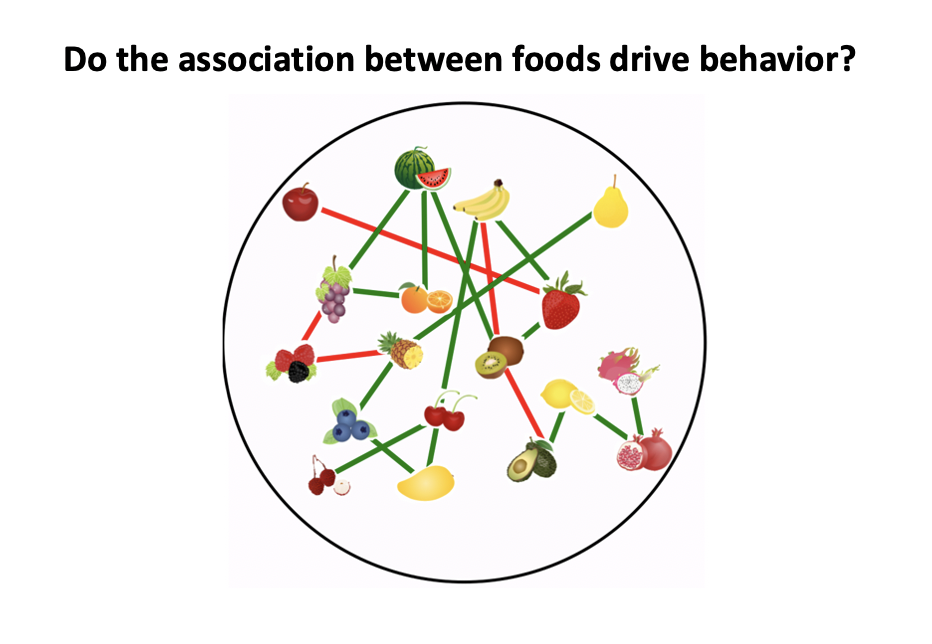

<h1>Uncovering the Role of Structural Properties in Food Association Networks</h1>
<em>Kianté Fernandez1, Uma R. Karmarkar3, Ian Krajbich1,2</em> 1 Department of Psychology, The Ohio State University; 2 Department of Economics, The Ohio State University; 3 Rady School of Management, University of California, San Diego    

Preference-based decisions, like choosing what to eat, often depend on associations between the options. For example, when selecting a fruit basket for the holidays, the relations between fruits contribute to the overall attractiveness of a basket. However, quantifying the relations between options is a non-trivial task. Ideally, the relations between options should relate to how they’re organized in a person’s memory. In this poster, I introduce a novel approach that utilizes semantic network modeling to quantify relations between groups of food options. By extracting descriptive measures of network organization, I showcase how the structure of knowledge representations of preferences can produce behavioral phenomena like choice, response times, and similarity judgments. In this study our goals are  

1. to investigate a new application of modeling knowledge representations as networks to quantify relations, between groups of options within preferential decision-making  
2. to examine how the structure of knowledge representations of preferences produces behavioral phenomena like choice, response times, and similarity judgements  

<b>Keywords</b>: decision making, centrality, network analysis, knowledge representations

<h2>Background</h2>

  
Definitions

  
  **Knowledge representations** 
 
  **Centrality** 

  **Subgraph** 

<h2>Tasks Description</h2>

    
Exposure and Ratings

    Participants first passively observed images of 60 individual snack foods. Each food was presented for 750 ms. Then, for each individual snack food, participants were asked to rate how much they would like to eat this food right now. Participants used a mouse to rate their desire to consume each of the 60 snack foods on a scale. The scale appeared to participants to be continuous, and the data was captured in increments of 1 (ranging from 1 to 100). Participants were be told to make the rating on a scale from “Not at all” to a rating of “Very much!” indicating that they really would like to eat the food item right now. Participants were able to revise their rating as many times as they liked before finalizing it. Participants clicked the “continue” button to finalize their value rating response and proceed to the next screen. This process continued for all 60 items.
 

 

    
2AFC

    Participants completed a binary choice task using the generated arrays of snack foods from the constructed food association network. In each trial, participants were presented with two arrays of food items, one array on each side of the screen, and were instructed to choose their preferred array of food items that they would most prefer to eat right now. Participants used the F key to choose the array of food items on the left side of the screen and the J key to choose the array of food items on the right side of the screen. Participants were instructed to make selections at their own pace. Each trial was designed so that the two arrays of food items differ in centrality. In addition, no pair of food item arrays were shown more than once. Each trial consisted of two arrays from the set of 100 presented in random order. Participants completed a total of 99 trials.

 

    
Similarity judgments

    In experiment two, after preforming the rating and choice task, for each of the 100 previously shown groups of items, subjects were asked to assess the preference similarity for each group of foods. For each group of items, subjects were asked to rate: if someone likes one of the foods, how likely is it that they also similarly like the other foods? Subjects were told to make the rating on a scale from “Not at all likely” to “Very likely”. Subjects used a mouse to rate each item on a scale. The scale appeared to be continuous, and the data was captured with integers ranging from 1 to 100.

<h2>Association Network Construction</h2>
We conducted a EGA. 

  
Principal component analysis (PCA)

  
Model Specification

<h2>References</h2>

1) Evers, E. R. K., Inbar, Y., & Zeelenberg, M. (2014). Set-fit effects in choice. Journal of Experimental Psychology: General, 143(2), 504–509. https://doi.org/10.1037/a0033343

2) Lee, D. G., & Holyoak, K. J. (2021). Coherence shifts in attribute evaluations. Decision, 8(4), 257. https://doi.org/10.1037/dec0000151

3) Collins, A. M., & Loftus, E. F. (1975). A spreading-activation theory of semantic processing. Psychological Review, 82, 407–428. https://doi.org/10.1037/0033-295X.82.6.407

4) Bhatia, S., & Mullett, T. L. (2018). Similarity and decision time in preferential choice. Quarterly Journal of Experimental Psychology, 71(6), 1276–1280. https://doi.org/10.1177/1747021818763054

5) Evers, E., Park, A., & Lakens, D. (2019). Low Complexity Drives Similarity Judgments Within Bundles of Products. ACR North American Advances.

6) Siew, C. S. Q., Wulff, D. U., Beckage, N. M., & Kenett, Y. N. (2019). Cognitive Network Science: A Review of Research on Cognition through the Lens of Network Representations, Processes, and Dynamics. Complexity, 2019, e2108423. https://doi.org/10.1155/2019/2108423

7) Christensen, A. P., & Golino, H. (2021). Estimating the Stability of Psychological Dimensions via Bootstrap Exploratory Graph Analysis: A Monte Carlo Simulation and Tutorial. Psych, 3(3), Article 3. https://doi.org/10.3390/psych3030032